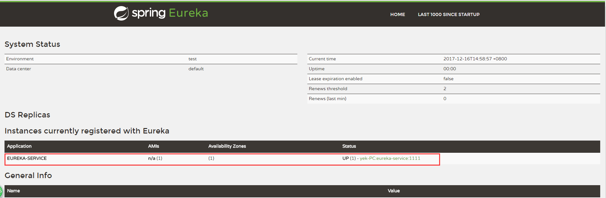
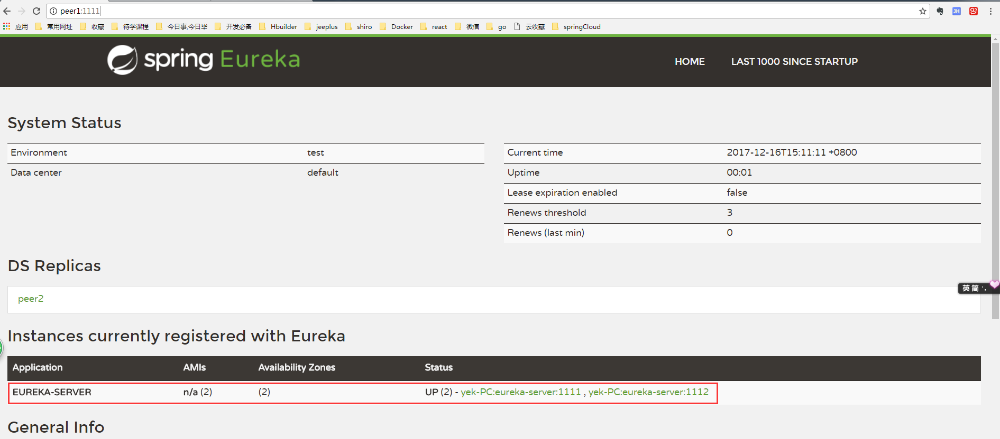
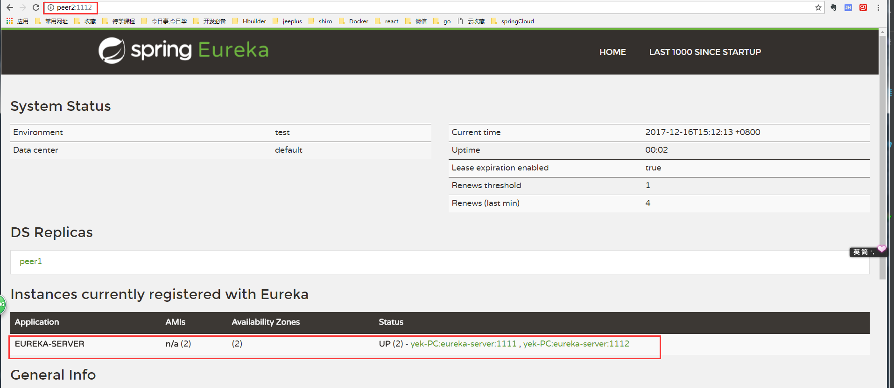
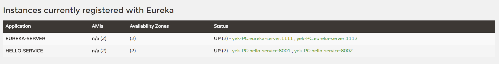
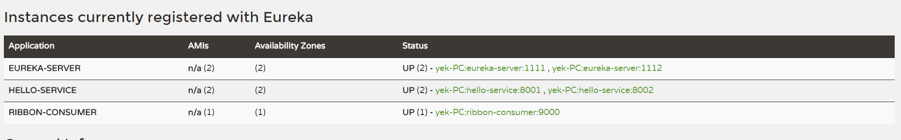

# Spring clound 初探

## 服务注册中心: eureka-service

配置文件:

```properties

# 指定主机名和端口号
server.port=1111
eureka.instance.hostname=localhost

# 指定 Eureka 服务注册中心的地址
eureka.client.serviceUrl.defaultZone=http://${eureka.instance.hostname}:${server.port}/eureka/


```
在 Eureka 的服务治理设计中,所有结点既是服务提供方,也是服务消费方,服务注册中心也不例外.按照上面的配置:

访问 : http://localhost:1111/

可以看到如图:


Application 那一栏名称为 UNKNOW,这是我们没有指定 spring.application.name 的值导致,现在改配置文件如下:

```properties

# 指定 在eureka注册中心的名称
spring.application.name= eureka-service


# 指定主机名和端口号
eureka.instance.hostname=localhost
server.port=1111


# Eureka 服务注册中心的地址
eureka.client.serviceUrl.defaultZone=http://${eureka.instance.hostname}:${server.port}/eureka/
```

刷新 http://localhost:1111/
可以看到:


可以看到 Application 和 status 两栏的值都发生改变.


## 服务注册中心的高可用配置

Eureka的高可用实际就是将自己作为服务向其他服务注册中心注册自己.

为了模拟我们有多台主机,我们更改本机host文件,添加如下两行
```
  127.0.0.1 peer1
  127.0.0.1 peer2
```
接下来创建两个Eureka的服务注册中心,进行高可用配置,具体看源代码,这里只贴出,两个配置文件:

peer1:

```properties
# 指定 在eureka注册中心的名称(高可用情况下这个名称要一致)
spring.application.name=eureka-server

# 指定主机名和端口号
server.port=1111
eureka.instance.hostname=peer1


# Eureka 服务中心的地址
eureka.client.serviceUrl.defaultZone=http://peer2:1112/eureka/
```

peer2:
```properties
# 指定 在eureka注册中心的名称(高可用情况下这个名称要一致)
spring.application.name=eureka-server

# 指定主机名和端口号
server.port=1112
eureka.instance.hostname=peer2

# Eureka 服务中心的地址
eureka.client.serviceUrl.defaultZone=http://peer1:1111/eureka/
```

可以看到两个Eureka服务相互注册,启动这两个Eureka服务,浏览器分别访问: http://peer1:1111/ 和 http://peer2:1112/

可以看到:






## 服务提供者

接下来我们创建两个服务提供者,然后注册到 Eureka 服务注册中心
配置如下:

1. user_api: 配置文件:
```properties
# 服务提供者名称
spring.application.name=hello-service

server.port=8001

# 服务注册中心地址
eureka.client.serviceUrl.defaultZone=http://localhost:1111/eureka/
```
Controller:

```java
/**
 * 用户微服务
 *
 * @author itguang
 * @create 2017-12-16 9:43
 **/
@RestController
@Slf4j
public class UserController {

    @Autowired
    private DiscoveryClient client;

    @RequestMapping(value = "/hello", method = RequestMethod.GET)
    public String hello() {

        ServiceInstance instance = client.getLocalServiceInstance();
        log.info("host={},service_id={},port={}", instance.getHost(), instance.getServiceId(), instance.getPort());
        return "hello world from user-api1";
    }
}
```

2. user_api2: 配置文件:

```properties
# 服务提供者名称
spring.application.name=hello-service
server.port=8002

# 服务注册中心地址
eureka.client.serviceUrl.defaultZone=http://localhost:1111/eureka/
```

Controller层:

```java
/**
 * 用户微服务
 *
 * @author itguang
 * @create 2017-12-16 9:43
 **/
@RestController
@Slf4j
public class UserController {

    @Autowired
    private DiscoveryClient client;

    @RequestMapping(value = "/hello", method = RequestMethod.GET)
    public String hello() {

        ServiceInstance instance = client.getLocalServiceInstance();
        log.info("host={},service_id={},port={}", instance.getHost(), instance.getServiceId(), instance.getPort());
        return "hello world from user-api1";
    }
}
```

可以看到我们在 8001 和8002 端口分别创建了两个服务提供者,现在分别启动他们:
浏览器分别访问: http://peer1:1111/ 和 http://peer2:1112/ 会看到如图所示:



多了两个名为 HELLO-SERVICE 的服务提供者,这和我们在两个服务提供者的配置文件中 设置的 spring.application.name 的值是一样的.


## 服务消费者

目前位置,服务注册中心和服务提供者我们都已经创建了,接下来就是创建一个服务消费者了.

服务消费者主要完成两个目标: 服务发现 与 服务消费.

其中 服务发现由 Eureka 客户端完成,而服务消费由 Ribbon 完成.(Ribbon是一个基于HTTP和TCP的客户端负载均衡器)

现在我们可以创建一个消费服务的应用 ribbon-consumer,下面给出主要的配置,具体可参考源码:

配置文件如下:

```properties

# 服务消费者在Eureka注册中心的名称
spring.application.name=ribbon-consumer

# 启动端口
server.port=9000


# 配置 eureka 注册中心的地址,可以是集群,可以是单机
eureka.client.serviceUrl.defaultZone=http://localhost:1111/eureka/
```
Controller层进行服务消费:

```java
/**
 * @author itguang
 * @create 2017-12-16 14:15
 **/
@RestController
public class ConsumerController {

    //这个 hello-service 是我们在服务提供者配置的 spring.application.name的值
    String helloServiceUrl = "http://hello-service/hello";


    @Autowired
    private RestTemplate restTemplate;


    @RequestMapping(value = "/ribbon-consumer")
    public String helloConsumer() {
        ResponseEntity<String> reponse = restTemplate.getForEntity(helloServiceUrl, String.class);
        String body = reponse.getBody();
        return body;
    }


}
```


最后不要忘了在所有的服务提供者和服务消费者的启动类上加上 `@EnableDiscoveryClient` 注解,
在Eureka注册中心的启动类上添加: `@EnableEurekaServer` 注解.

最后再启动服务消费者.

浏览器分别访问: http://peer1:1111/ 和 http://peer2:1112/ 会看到如图所示:



又多了一个 RIBBON-SERVICE 并且有一个实例;ribbon-consumer:9000 

现在我们浏览器再访问服务消费者: http://localhost:9000/ribbon-consumer,不停刷新

会看到: hello world from user_api1 和 hello world from user-api2 交替出现.

这说明我们是以轮训的策略访问 yek-PC:hello-service:8001 , yek-PC:hello-service:8002 这两个服务提供者.


