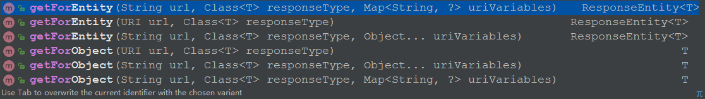
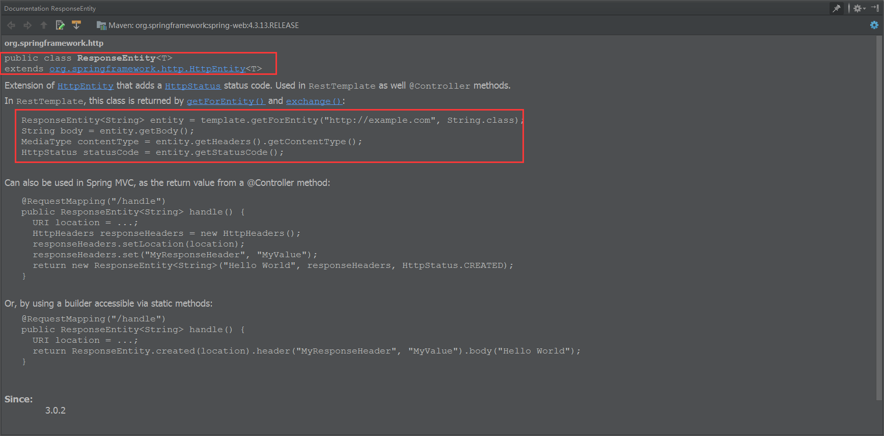
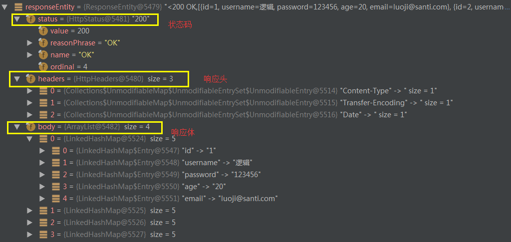
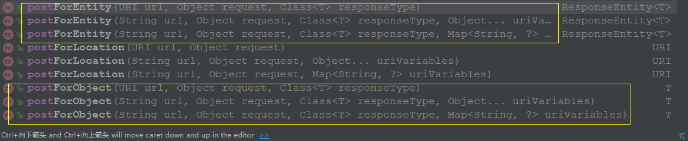
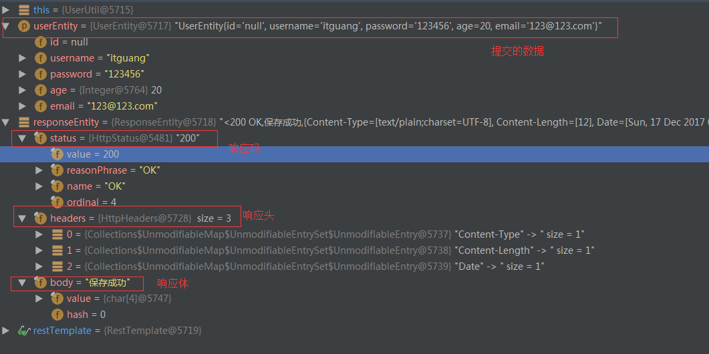

# 详解 RestTemplate 操作

作为开发人员，我们经常关注于构建伟大的软件来解决业务问题。数据只是软件完成工作时
要处理的原材料。但是如果你问一下业务人员，数据和软件谁更重要的话，他们很可能会选择
数据。数据是许多业务的生命之血。软件通常是可以替换的，但是多年积累的数据是永远不能
替换的。

近几年来,以信息为中心的表述性状态转移(**Representational State Transfer，REST**)已经称为替代传统SOAP Web 服务的流行方案.
SOAP关注的一般是行为和处理,而REST关注的是要处理的数据.

从Spring3.0开始,Spring为创建Rest API提供了良好的支持.

REST提供了一个更简单的可选方案。另外，很多的现代化应用都会有移动或富JavaScript客户端，它们都会使用运行在服务器上REST API。

## REST的基础知识

**当谈论REST时，有一种常见的错误就是将其视为“基于URL的Web服务”——将REST作为另一
种类型的远程过程调用（remote procedure call，RPC）机制，就像SOAP一样，只不过是通过简单
的HTTP URL来触发，而不是使用SOAP大量的XML命名空间。**

**恰好相反，REST与RPC几乎没有任何关系。RPC是面向服务的，并关注于行为和动作；而REST
是面向资源的，强调描述应用程序的事物和名词**。

更简洁地讲，**REST就是将资源的状态以最适合客户端或服务端的形式从服务器端转移到客户
端（或者反过来）**。


在REST中，资源通过URL进行识别和定位。至于RESTful URL的结构并没有严格的规则，但是
URL应该能够识别资源，而不是简单的发一条命令到服务器上。再次强调，关注的核心是事
物，而不是行为。


## Spring 中如何使用Rest资源

借助 RestTemplate，Spring应用能够方便地使用REST资源
Spring的 RestTemplate访问使用了模版方法的设计模式.

模版方法将过程中与特定实现相关的部分委托给接口,而这个接口的不同实现定义了接口的不同行为.

RestTemplate定义了36个与REST资源交互的方法，其中的大多数都对应于HTTP的方法。
其实，这里面只有11个独立的方法，其中有十个有三种重载形式，而第十一个则重载了六次，这样一共形成了36个方法。


* delete() 在特定的URL上对资源执行HTTP DELETE操作

* exchange()
  在URL上执行特定的HTTP方法，返回包含对象的ResponseEntity，这个对象是从响应体中
  映射得到的
  
* execute() 在URL上执行特定的HTTP方法，返回一个从响应体映射得到的对象

* **getForEntity()** 发送一个HTTP GET请求，返回的ResponseEntity包含了响应体所映射成的对象

* **getForObject()** 发送一个HTTP GET请求，返回的请求体将映射为一个对象

* **postForEntity()**
  POST 数据到一个URL，返回包含一个对象的ResponseEntity，这个对象是从响应体中映射得
  到的
  
* **postForObject()** POST 数据到一个URL，返回根据响应体匹配形成的对象

* headForHeaders() 发送HTTP HEAD请求，返回包含特定资源URL的HTTP头

* optionsForAllow() 发送HTTP OPTIONS请求，返回对特定URL的Allow头信息

* postForLocation() POST 数据到一个URL，返回新创建资源的URL

* put() PUT 资源到特定的URL


实际上,由于Post 操作的非幂等性,它几乎可以代替其他的CRUD操作.


## Get请求



RestTemplate 的get方法有以上几个,可以分为两类: getForEntity() 和 getForObject()

首先看 getForEntity() 的返回值类型 ResponseEntity

```java
<T> ResponseEntity<T> getForEntity()
```

看一下 ResponseEntity 的文档描述:



可以看到 它继承了HttpEntity. 封装了返回的响应信息,包括 响应状态,响应头 和 响应体.


**在测试之前我们首先 创建一个Rest服务,模拟提供Rest数据,这里给出Controller层代码,具体可以查看源码,文章最后会给出**:

```java
/**
 * @author itguang
 * @create 2017-12-17 10:37
 **/
@RestController
public class UserController {

    @Autowired
    private UserService userService;

    @RequestMapping(value = "getAll")
    public List<UserEntity> getUser() {
        List<UserEntity> list = userService.getAll();
        return list;
    }

    @RequestMapping("get/{id}")
    public UserEntity getById(@PathVariable(name = "id") String id) {

        return userService.getById(id);
    }


    @RequestMapping(value = "save")
    public String save(UserEntity userEntity) {

        return "保存成功";
    }
    
    
    @RequestMapping(value = "saveByType/{type}")
    public String saveByType(UserEntity userEntity,@PathVariable("type")String type) {

        return "保存成功,type="+type;
    }


}

```

### 测试: getForEntity


1. 无参数的 getForEntity 方法
```java
 @RequestMapping("getForEntity")
    public List<UserEntity> getAll2() {
        ResponseEntity<List> responseEntity = restTemplate.getForEntity("http://localhost/getAll", List.class);
        HttpHeaders headers = responseEntity.getHeaders();
        HttpStatus statusCode = responseEntity.getStatusCode();
        int code = statusCode.value();

        List<UserEntity> list = responseEntity.getBody();

        System.out.println(list.toString());
        return list;

    }
```
2. 有参数的 getForEntity 请求,参数列表,可以使用 {} 进行url路径占位符
```java
 //有参数的 getForEntity 请求,参数列表
    @RequestMapping("getForEntity/{id}")
    public UserEntity getById2(@PathVariable(name = "id") String id) {

        ResponseEntity<UserEntity> responseEntity = restTemplate.getForEntity("http://localhost/get/{id}", UserEntity.class, id);
        UserEntity userEntity = responseEntity.getBody();
        return userEntity;
    }
```

3. 有参数的 get 请求,使用map封装参数
```java

    //有参数的 get 请求,使用map封装参数
    @RequestMapping("getForEntity/{id}")
    public UserEntity getById4(@PathVariable(name = "id") String id) {
        HashMap<String, String> map = new HashMap<>();
        map.put("id",id);

        ResponseEntity<UserEntity> responseEntity = restTemplate.getForEntity("http://localhost/get/{id}", UserEntity.class, map);
        UserEntity userEntity = responseEntity.getBody();

        return userEntity;
    }
```

通过断点调试我们看下 返回的 responseEntity 的信息如图:



因此我们可以获取Http请求的全部信息.

但是,通常情况下我们并不想要Http请求的全部信息,只需要相应体即可.对于这种情况,RestTemplate提供了 getForObject() 方法用来只获取 响应体信息.
getForObject 和 getForEntity 用法几乎相同,指示返回值返回的是 响应体,省去了我们 再去 getBody() .


### 测试: getForObject

1. 无参数的 getForObject 请求

```java

    //无参数的 getForObject 请求
    @RequestMapping("getAll2")
    public List<UserEntity> getAll() {
        List<UserEntity> list = restTemplate.getForObject("http://localhost/getAll", List.class);


        System.out.println(list.toString());
        return list;

    }
```
2. 有参数的 getForObject 请求,使用参数列表

```java

    //有参数的 getForObject 请求
    @RequestMapping("get2/{id}")
    public UserEntity getById(@PathVariable(name = "id") String id) {

        UserEntity userEntity = restTemplate.getForObject("http://localhost/get/{id}", UserEntity.class, id);

        return userEntity;
    }
```
3. 有参数的 get 请求,使用map封装请求参数

```java

    //有参数的 get 请求,使用map封装请求参数
    @RequestMapping("get3/{id}")
    public UserEntity getById3(@PathVariable(name = "id") String id) {
        HashMap<String, String> map = new HashMap<>();
        map.put("id",id);

        UserEntity userEntity = restTemplate.getForObject("http://localhost/get/{id}", UserEntity.class, map);

        return userEntity;
    }
```

## Post请求

了解了get请求后,Post请求就变得很简单了,我们可以看到post有如下方法:




### 测试: postForEntity

1. post 请求,保存 UserEntity 对像

```java

    //post 请求,提交 UserEntity 对像

    @RequestMapping("saveUser")
    public String save(UserEntity userEntity) {

        ResponseEntity<String> responseEntity = restTemplate.postForEntity("http://localhost/save", userEntity, String.class);
        String body = responseEntity.getBody();

        return body;

    }
```

浏览器访问: http://localhost/saveUser?username=itguang&password=123456&age=20&email=123@123.com
我们再次断点调试,查看 responseEntity 中的信息:



2. 有参数的 postForEntity 请求

```java

   // 有参数的 postForEntity 请求
    @RequestMapping("saveUserByType/{type}")
    public String save2(UserEntity userEntity,@PathVariable("type")String type) {

        ResponseEntity<String> responseEntity = restTemplate.postForEntity("http://localhost/saveByType/{type}", userEntity, String.class, type);
        String body = responseEntity.getBody();

        return body;

    }

    // 有参数的 postForEntity 请求,使用map封装
    @RequestMapping("saveUserByType2/{type}")
    public String save3(UserEntity userEntity,@PathVariable("type")String type) {
        HashMap<String, String> map = new HashMap<>();
         map.put("type", type);


        ResponseEntity<String> responseEntity = restTemplate.postForEntity("http://localhost/saveByType/{type}", userEntity, String.class,map);
        String body = responseEntity.getBody();

        return body;

    }


```

我们浏览器访问: localhost/saveUserByType/120?username=itguang&password=123456&age=20&email=123@123.com

就会返回: 保存成功,type=120 

对与其它请求方式,由于不常使用,所以这里就不再讲述.


> 源码地址: https://github.com/itguang/springcloud-learn/tree/master/resttemplate-test


